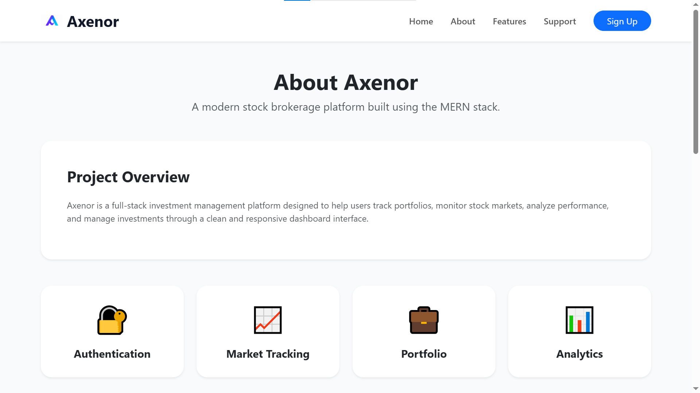
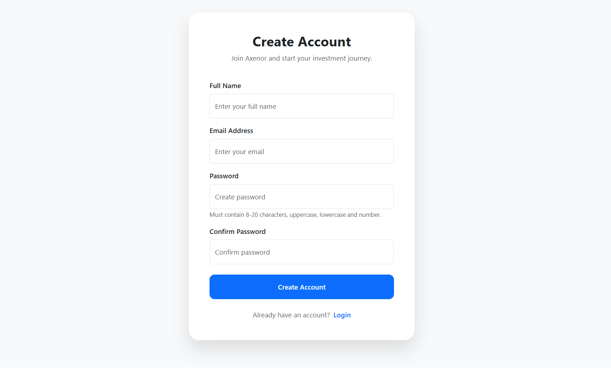
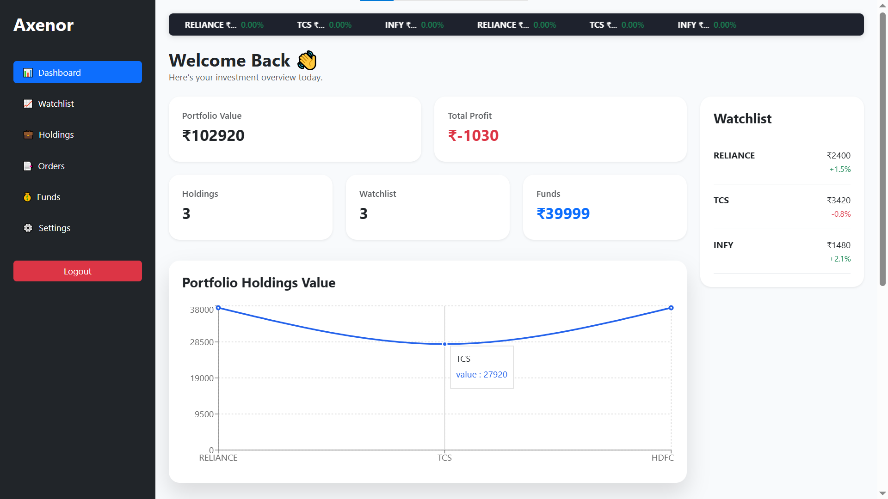

# Axenor

Axenor is a full-stack stock brokerage platform that enables users to manage investments through a secure and intuitive dashboard. The application provides portfolio tracking, watchlist management, order monitoring, fund management, authentication, and market insights through a modern and responsive web interface.

Built using the MERN Stack, Axenor follows industry-standard development practices including JWT authentication, password hashing, protected routes, cloud database integration, CI/CD automation, and responsive design.

---

## Live Demo

### Frontend

https://axenor-theta.vercel.app

### Backend API

https://axenor-7t91.onrender.com

> Note: The backend is hosted on Render's free tier. The first request after a period of inactivity may take a few seconds while the server wakes up.

---
## Demo Access

Use the following demo account to explore the platform:

Email: test@gmail.com
Password: 123456

> This account contains sample data for demonstration and evaluation purposes.
---

## 📸 Application Preview

| Landing Page | About |
|-------------|-------------|
|  |  |

| Authentication | Dashboard |
|-------------|-------------|
|  |  |

| Watchlist Management | Order Tracking |
|-------------|-------------|
|  |  |

| Funds Management |
|-------------|
|  |
---

## Features

### Authentication & Security

* User Registration and Login
* JWT-based Authentication
* Protected Dashboard Routes
* Password Hashing using bcrypt
* Secure Session Management

### Portfolio Management

* Portfolio Value Tracking
* Profit & Loss Calculation
* Holdings Management
* Watchlist Management
* Order Tracking
* Funds Deposit & Withdrawal

### Dashboard Analytics

* Portfolio Summary Dashboard
* Market Overview
* Portfolio Performance Charts
* Recent Orders Overview
* Holdings Overview

### User Experience

* Responsive Design
* Modern UI Components
* Toast Notifications
* Smooth Animations
* Clean Navigation System

---

## Tech Stack

### Frontend

* React.js
* React Router DOM
* Axios
* Bootstrap 5
* Recharts
* React Toastify
* AOS

### Backend

* Node.js
* Express.js
* JWT Authentication
* bcryptjs

### Database

* MongoDB Atlas
* Mongoose

### Deployment

* Vercel (Frontend)
* Render (Backend)
* MongoDB Atlas (Database)

### CI/CD

* GitHub Actions
* Automatic Deployment via GitHub Integration

---

## Project Structure

```bash
Axenor/
│
├── backend/
│   ├── controllers/
│   ├── middleware/
│   ├── models/
│   ├── routes/
│   ├── config/
│   └── server.js
│
├── frontend/
│   ├── public/
│   ├── src/
│   │   ├── dashboard/
│   │   ├── landing_page/
│   │   ├── __tests__/
│   │   └── components/
│   └── package.json
│
├── .github/
│   └── workflows/
│
├── .gitignore
└── README.md
```

## Installation

### Clone Repository

```bash
git clone https://github.com/Pramodh369/Axenor.git
```

### Backend Setup

```bash
cd backend
npm install
npm start
```

### Frontend Setup

```bash
cd frontend
npm install
npm start
```

## Environment Variables

Create a `.env` file inside the backend folder.

```env
MONGO_URL=your_mongodb_connection_string
JWT_SECRET=your_secret_key
PORT=5000
```

## Testing

Run tests using:

```bash
npm test
```

Current test coverage includes:

* Portfolio Profit Calculation
* Portfolio Value Calculation
* Funds Balance Calculation

## Database Collections

The application uses MongoDB Atlas and stores data in the following collections:

* users
* holdings
* watchlists
* orders
* funds

User passwords are securely stored using bcrypt hashing.

## Future Enhancements

* Real-Time Market Data Integration
* Advanced Portfolio Analytics
* Portfolio Reports Export
* Email Notifications
* Stock Search & Filtering

## Author

**Pramodh**

Full-Stack MERN Developer

## License

This project is licensed under the MIT License.
